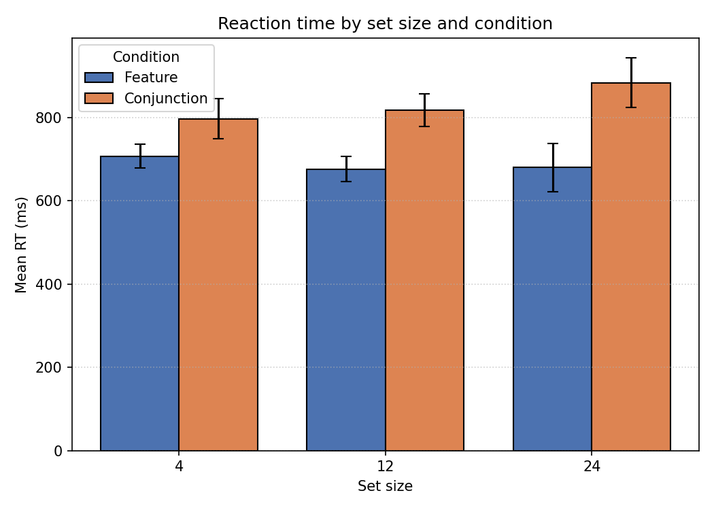
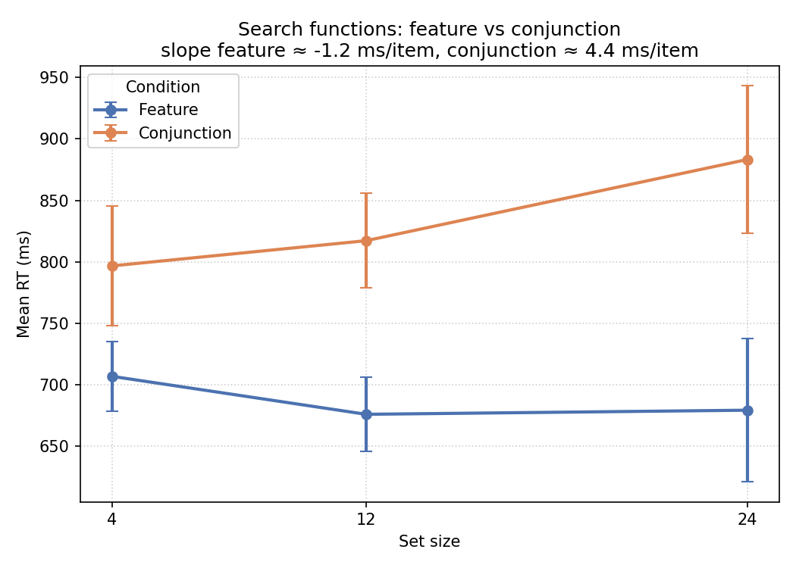
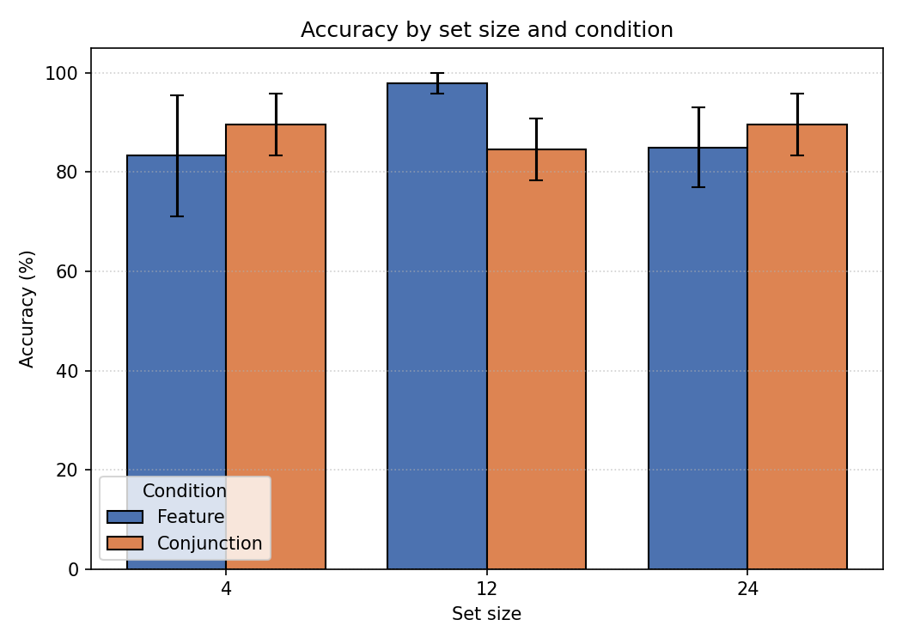

# Visual Search Midterm Project — Feature vs Conjunction

中央大學認知神經科學所｜計算神經科學 2026 春季｜Week 8 期中專案
作者：何官臻（Irene Ho, 114825002）

**Pavlovia 實驗連結**：<https://pavlovia.org/ireneho3507/visualsearch_midterm>
**GitHub Repo**：<https://github.com/ireneho3507-ship-it/week8_midterm_project>

---

## 1. 研究目的與假設

本實驗以 Treisman 的 *Feature Integration Theory* (Treisman & Gelade, 1980)
為理論基礎，比較 **特徵搜尋 (feature search)** 與 **連接搜尋 (conjunction search)**
在不同陣列大小 (set size) 下的表現差異。

- **假設 1（搜尋斜率）**：feature 條件下反應時間 (RT) 不應隨 set size 顯著增加
  （pop-out，平行處理）；conjunction 條件下 RT 應隨 set size 線性上升
  （serial self-terminating search）。
- **假設 2（條件主效果）**：在所有 set size，conjunction 的 RT 均顯著長於
  feature。
- **假設 3（準確度）**：兩條件下的整體準確度應維持在 80% 以上，且 set size
  對準確度的影響應小於對 RT 的影響（speed–accuracy trade-off 不明顯）。

## 2. 實驗設計

### 受試者
N = 8 位 pilot 參與者（含 4/15 課堂前測 5 位、4/16 補測 1 位、4/19 課堂 demo 2 位）。
所有參與者皆為大學生／研究生，視力正常或矯正後正常。

### 刺激與條件
2 (condition_type: feature / conjunction) × 3 (set_size: 4 / 12 / 24)
× 2 (target_present: yes / no) 受試者內設計，每 cell 重複 6 次，共 **36 正式試次**
（完整試次表見 `formal_cond.xlsx`）。

| 因子 | 水準 | 說明 |
|---|---|---|
| condition_type | feature | 目標僅在單一維度（顏色 *或* 形狀）與 distractor 不同 |
| condition_type | conjunction | 目標需以兩個維度的組合定義（顏色 *且* 形狀） |
| set_size | 4 / 12 / 24 | 搜尋陣列中的物件總數 |
| target_present | 1 / 0 | 目標出現／未出現（按 right ／ left 鍵） |

### 試次流程
注視十字 (500 ms) → 搜尋陣列（最長 5 s 或按鍵反應）→ 練習階段提供回饋
→ ITI 500 ms。
正式 36 trials 前另有練習區塊（`practice_cond.xlsx`，6 trials），完成後給予
階段休息與結束畫面。

### 計時 / 介面
- 取樣率：依瀏覽器 frame rate（CSV 紀錄為 ~60 Hz）
- 反應裝置：鍵盤 left / right 方向鍵
- 部署：PsychoPy Builder 編譯為 PsychoJS，部署至 Pavlovia（`Running` 狀態）
- 跨瀏覽器測試：Chrome、Firefox

## 3. 資料蒐集

實驗於 2026/04/15 – 2026/04/19 共 5 天進行 pilot 蒐集，原始 CSV 儲存於 `data/`。

| Participant ID | 日期 | Trials | Notes |
|---|---|---|---|
| 1 | 2026-04-15 | 36 | 課堂前測 |
| 2 | 2026-04-15 | 36 | 課堂前測 |
| 3 | 2026-04-15 | 36 | 課堂前測 |
| 4 | 2026-04-15 | 36 | 課堂前測 |
| 5 | 2026-04-15 | 36 | 課堂前測 |
| 190332 | 2026-04-16 | 36（27 有 RT） | 部分缺值 |
| 098713 | 2026-04-19 | 36 | 課堂 demo |
| 808749 | 2026-04-19 | 36 | 課堂 demo |

排除標準（在 `analysis/analysis.py` 中實作）：

1. 排除非正式 trial（保留 `formal_loop.thisN` 非 NA 的列）。
2. 排除缺反應或缺 RT 的試次。
3. 排除 RT < 100 ms 或 > 1500 ms（過早與過遲反應）。

清理後保留 271 / 288 trials (94.1%)。

## 4. 分析方法

腳本：`analysis/analysis.py`（純 Python：pandas + matplotlib，無外部依賴）。
分析流程：

1. 讀入 `INCLUDED_PIDS` 內 8 位參與者之 CSV，以 `formal_loop.thisN` 過濾正式試次。
2. 套用上述排除標準。
3. 以 **per-subject means** 計算每位受試者在 6 個 cells 的平均 RT
   （僅 correct trials）與準確度。
4. 跨受試者計算各 cell 的平均、SEM (between-subject standard error)。
5. 繪製：
   - `figures/rt_by_setsize_condition.png`：RT × set_size × condition 長條圖（含 SEM）
   - `figures/accuracy_by_setsize_condition.png`：accuracy 長條圖（含 SEM）
   - `figures/search_slopes.png`：search functions 折線圖，標註斜率（ms/item）
6. 以線性回歸估計搜尋斜率（mean RT vs set_size）。

執行方式：

```bash
cd analysis
python analysis.py
```

## 5. 主要結果

### 5.1 反應時間


| condition | set_size = 4 | set_size = 12 | set_size = 24 |
|---|---|---|---|
| feature | 707 ± 28 ms | 676 ± 30 ms | 679 ± 58 ms |
| conjunction | 797 ± 49 ms | 817 ± 39 ms | 883 ± 60 ms |

（mean ± SEM, n = 8）

### 5.2 搜尋斜率


- **Feature slope ≈ −1.2 ms/item**（實際上 flat，符合 pop-out 預測）
- **Conjunction slope ≈ +4.4 ms/item**（隨 set size 上升，符合 serial search）

### 5.3 準確度


兩條件下準確度多在 83 – 98% 之間，未出現天花板效應，也無明顯 speed–accuracy
trade-off。

### 5.4 結果解讀與反思
1. **支持 FIT**：feature 條件下 RT 與 set size 幾乎無關（slope ≈ 0），
   而 conjunction 條件下 RT 隨 set size 上升，與 Treisman & Gelade (1980)
   的經典結果一致。
2. **conjunction slope 偏小（4.4 ms/item）**：典型 conjunction search 斜率多
   在 10 – 30 ms/item。本實驗斜率較淺可能源於 (a) 樣本數小 (n = 8)、
   (b) target_present 與 absent 試次未分開分析（理論上 absent 應有 ~2× 斜率）、
   (c) 刺激的特徵差異過於明顯，使 conjunction 試次仍保有部分 pop-out 性質。
3. **改進方向**：
   - 將 target_present 納入分析因子，分別估計 present / absent 斜率。
   - 增加 set size 範圍（如 4 / 8 / 16 / 32）以增強斜率估計穩定度。
   - 蒐集 ≥ 20 位正式參與者以提升統計力。
   - 加入眼動或反應確信度量測，了解 serial search 的微觀機制。

---

## Repo 結構

```
week8_midterm_project/
├── readme.md                       # 本檔
├── midterm_project.psyexp          # PsychoPy Builder 實驗主檔
├── midterm_project.py              # 編譯後 Python 版本
├── midterm_project.js              # PsychoJS 版本（Pavlovia 用）
├── midterm_project-legacy-browsers.js
├── index.html                      # Pavlovia 入口
├── formal_cond.xlsx                # 正式試次條件表 (36 trials)
├── practice_cond.xlsx              # 練習試次條件表
├── analysis/
│   └── analysis.py                 # 主分析腳本
├── figures/
│   ├── rt_by_setsize_condition.png
│   ├── accuracy_by_setsize_condition.png
│   └── search_slopes.png
└── data/                           # pilot CSV (8 位有效參與者)
```

## 重現步驟

```bash
git clone https://github.com/ireneho3507-ship-it/week8_midterm_project.git
cd week8_midterm_project
pip install pandas numpy matplotlib
cd analysis && python analysis.py
```

執行後 `figures/` 內的 3 張圖會被重新產生。

## 參考文獻
Treisman, A. M., & Gelade, G. (1980). A feature-integration theory of attention.
*Cognitive Psychology, 12*(1), 97–136.
